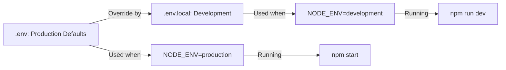

# Development & Production Optimization Guide

## ⚡ Quick Start

### Development Mode

```bash
# Fast development with Hot Module Replacement (HMR)
npm run dev

# Alternative: with Fast Refresh enabled
npm run dev:fast

# Clean cache and start fresh
npm run dev:clean
```

### Production Mode

```bash
# Build for production
npm run build

# Start production server
npm start
```

---

## 🔧 Configuration Overview

### **Development Environment** (`NODE_ENV=development`)

#### What's Optimized:

- **Zero Cache**: All responses set to `no-store, no-cache, must-revalidate, max-age=0`
- **Fast Refresh**: Instant component updates without full page reload
- **Disabled ETags**: Faster builds by skipping cache validation
- **File Watching**: WATCHPACK_POLLING disabled for better performance
- **No Compression**: Skips gzip compression for faster dev builds
- **HMR Enabled**: Server Components cache disabled for instant updates

#### Key Settings in `.env.local`:

```env
NODE_ENV=development
WATCHPACK_POLLING=false
FAST_REFRESH=true
__NEXT_DATA_CACHE=false
```

#### Key Settings in `next.config.ts`:

```typescript
// Development: No caching headers
Cache-Control: no-store, no-cache, must-revalidate, max-age=0

// Development: Disabled HMR cache
serverComponentsHmrCache: false

// Development: Faster builds
compress: false
generateEtags: false
```

---

### **Production Environment** (`NODE_ENV=production`)

#### What's Optimized:

- **Aggressive Caching**: 1-year immutable cache for static assets
- **Tree-Shaking**: Optimized package imports remove unused code
- **Compression**: Gzip compression enabled for smaller responses
- **Console Removal**: All `console.log()` stripped from bundles
- **ETags**: Cache validation enabled for smart invalidation
- **Security Headers**: Reduced response size with no `X-Powered-By`

#### Caching Strategy:

```
Static Assets (SVG, JPG, PNG, etc): 1 year (immutable)
/_next/static/* : 1 year (immutable)
/api/* : no-store (always fresh)
HTML Pages: 1 hour with s-maxage
```

#### Key Settings in `next.config.ts`:

```typescript
// Production: Aggressive caching
Cache-Control: public, max-age=31536000, immutable

// Production: Tree-shaking
optimizePackageImports: [lucide-react, recharts, ...]

// Production: Compression
compress: true
removeConsole: true
```

---

## 📊 Performance Comparison

| Feature         | Development     | Production            |
| --------------- | --------------- | --------------------- |
| **Cache**       | Disabled        | Aggressive (1 year)   |
| **Compression** | ❌ No           | ✅ Yes (Gzip)         |
| **Console.log** | ✅ Kept         | ❌ Removed            |
| **ETags**       | ❌ Disabled     | ✅ Enabled            |
| **HMR**         | ✅ Fast Refresh | ❌ N/A                |
| **Build Time**  | 🚀 Fast         | 🔨 Slower (optimized) |
| **Bundle Size** | Larger          | 📉 Minimal            |

---

## 🎯 Common Issues & Solutions

### **Issue: Changes not reflecting in dev**

```bash
# Solution: Clean cache and restart
npm run dev:clean
```

### **Issue: Slow hot reload**

```bash
# Solution: Ensure .env.local has correct settings
# Check WATCHPACK_POLLING=false
npm run dev:fast
```

### **Issue: Production is slow**

```bash
# Solution: Verify production build
npm run build
npm start

# Check cache headers in Network tab (DevTools)
```

### **Issue: Cache too aggressive in dev**

```bash
# Solution: .env.local overrides .env automatically
# No action needed - it's already configured
```

---

## 🔍 How to Verify Configuration

### Development - Check Cache Headers:

1. Open DevTools → Network tab
2. Reload page
3. Click any asset → Response Headers
4. Verify: `Cache-Control: no-store, no-cache, must-revalidate, max-age=0`

### Production - Check Cache Headers:

1. Build: `npm run build`
2. Start: `npm start`
3. Open Network tab
4. Verify static assets have: `Cache-Control: public, max-age=31536000, immutable`

---

## 📝 Configuration Files

### `.env` (Shared / Production Default)

- Database URL
- API Keys
- Production settings

### `.env.local` (Development Override)

- Caching disabled
- HMR enabled
- Fast Refresh enabled
- **NOT committed to git**

### `next.config.ts` (Main Config)

- Environment-aware settings
- Caching strategies
- Image optimization
- Production optimizations

---

## 🚀 Best Practices

### Development:

✅ Always use `npm run dev` for development  
✅ Changes should reflect instantly (Fast Refresh)  
✅ Use `npm run dev:clean` if issues persist  
✅ Check `.env.local` is not tracked in git

### Production:

✅ Always run `npm run build` before deploying  
✅ Start with `npm start` (sets NODE_ENV=production)  
✅ Verify cache headers before going live  
✅ Use Docker: `docker build -t app . && docker run -p 3000:3000 app`

---

## 📚 Next.js Documentation References

- [Next.js Configuration](https://nextjs.org/docs/app/api-reference/next-config-js)
- [Caching Strategy](https://nextjs.org/docs/app/building-your-application/caching)
- [Fast Refresh](https://nextjs.org/docs/architecture/fast-refresh)
- [Image Optimization](https://nextjs.org/docs/app/building-your-application/optimizing/images)

---

## 🔗 Environment Defaults



---

**Last Updated**: December 2025  
**Next.js Version**: 15.5.7+

"testing"
